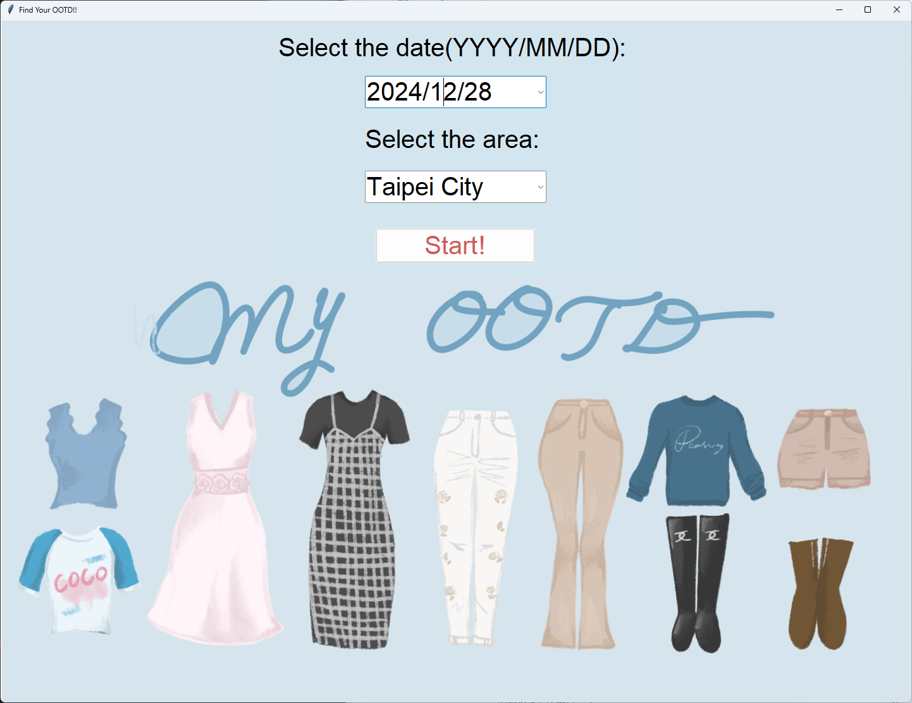
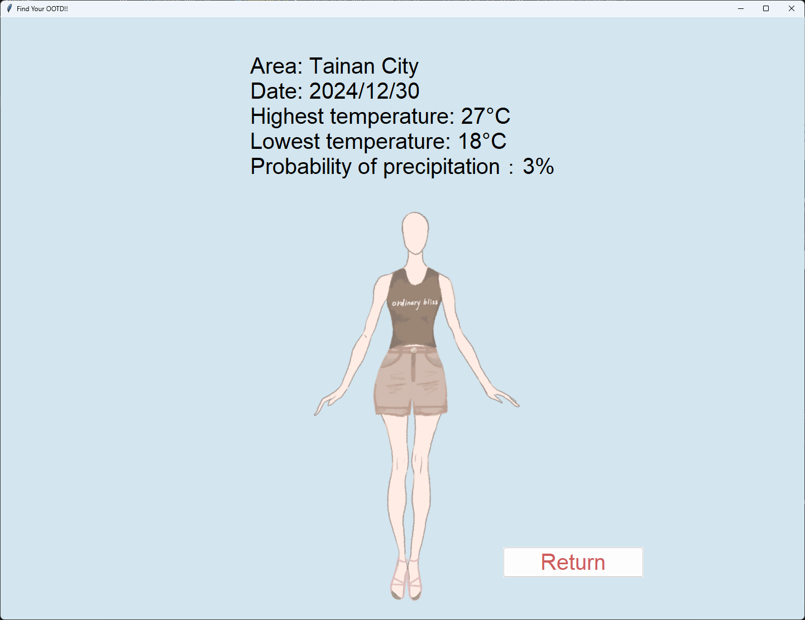

# My OOTD
This project provides a toolkit to  get the weather of the selected date and area and recommend the best clothing.



## How to run:
* run [screen.py](screen.py), select the date and area and press Start!

* press Return to go back to menu

#### Requirements
```
pip install -r requirements.txt